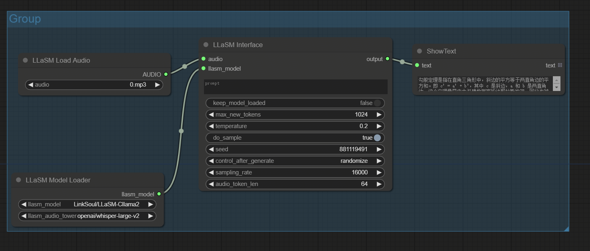

# ComfyUI nodes to use LLaSM

https://huggingface.co/spaces/LinkSoul/LLaSM

## Install

- 推荐使用管理器 ComfyUI Manager 安装（On the Way）

- 手动安装：
    1. `cd custom_nodes`
    2. `git clone https://github.com/leeguandong/ComfyUI_LLaSM.git`
    3. 重启 ComfyUI

## Use

- huggingface-cli download --resume-download --local-dir-use-symlinks False LinkSoul/LLaSM-Cllama2 --local-dir LLaSM-Cllama2
- huggingface-cli download --resume-download --local-dir-use-symlinks False openai/whisper-large-v2 --local-dir whisper-large-v2

- 节点：

   - LLaSM Model Loader：自动加载 M3Net 模型
   - LLaSM2Interface：推理
   - LLaSM Load Audio：加载音频

## Stars 

